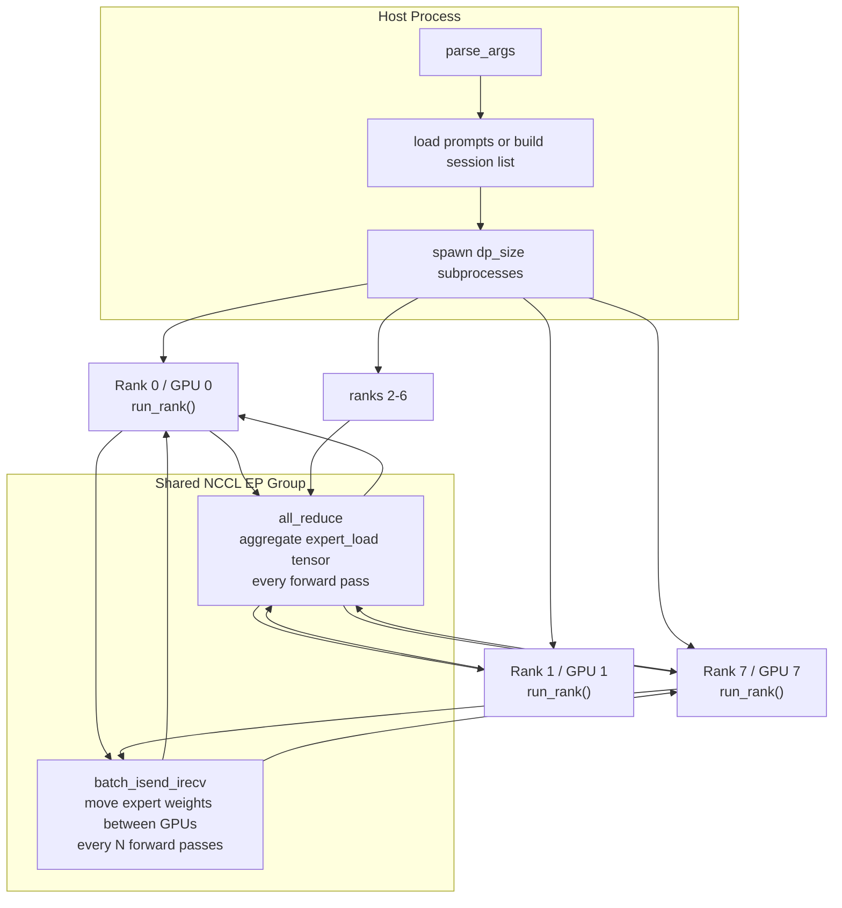
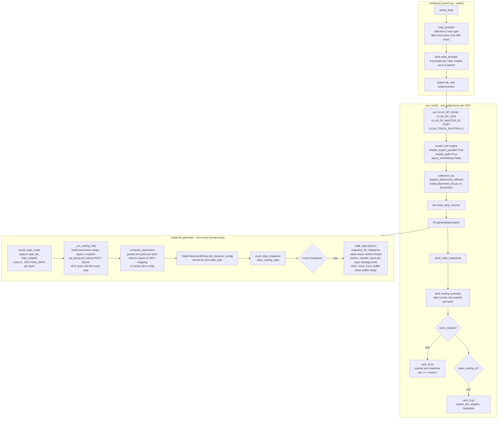
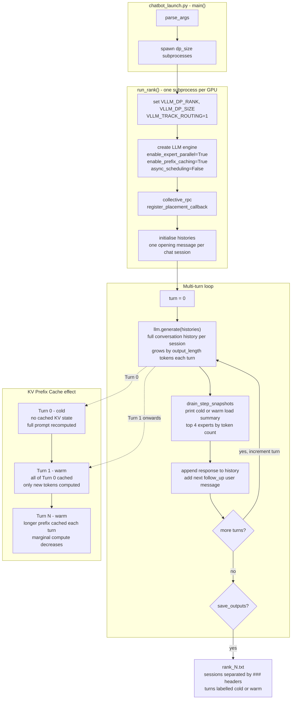

# moe-merged branch — System Overview

## What this branch does

Two capabilities run together on top of vLLM's DP+EP stack:

| Feature | What it does |
|---|---|
| **Token routing tracking** | Captures `{topk_ids, topk_weights, num_tokens}` for every token, every MoE layer, every forward pass |
| **JSON-driven expert placement** | `StaticPlacementPolicy` reads a config file and physically moves expert weights via NCCL P2P |
| **Live `compute_placement()` callback** | Routing load is all-reduced across EP ranks; callback receives global load and returns a new expert→GPU mapping applied before the next EPLB step |

---

## Script diagrams

> **VSCode note:** Mermaid diagrams require the
> [Markdown Preview Mermaid Support](https://marketplace.visualstudio.com/items?itemName=bierner.markdown-mermaid)
> extension (by Matt Bierner). Install it, then use **Ctrl+Shift+V** to open the preview.

---

### Parallel execution model (both scripts)

Every script spawns one subprocess per DP rank. Each subprocess owns one GPU (or `tp_size` GPUs) and runs a fully independent vLLM engine. The only shared state is the NCCL EP group used for two collectives: `all_reduce` to aggregate expert load every forward pass, and `batch_isend_irecv` to physically move expert weights when EPLB fires.



---

### `combined_launch.py` flow



---

### `chatbot_launch.py` flow



---

## How it all fits together

```
Each forward pass (execute_model)
│
├─ fused_topk_router.py  ← captures {topk_ids, topk_weights, num_tokens}
│    └─ writes into _ROUTING_DATA[layer_id]   (EP-rank-aware: local tokens only)
│
├─ _on_routing_step()  (gpu_model_runner.py)
│    │
│    ├─ get_routing_data()          ← read this step's captures
│    ├─ _aggregate_routing_load()   ← build load[layers, experts] tensor
│    │    ├─ uses eplb_state for shape if routing_snapshot is empty
│    │    ├─ ep_group.all_reduce(load)  ← NCCL barrier: ALL 8 ranks call this
│    │    │                               every step, even with a zero tensor
│    │    └─ returns {} if global sum == 0 (no real tokens → skip callback)
│    │
│    ├─ compute_placement(global_snapshot)  ← user callback (placement_fns.py)
│    │    └─ greedy bin-packing on expert_load → {"expert_to_gpu": {...}}
│    │
│    ├─ StaticPlacementPolicy.set_dynamic_config(placement)
│    ├─ push_step_snapshot()        ← archive for drain_step_snapshots()
│    └─ clear_routing_data()        ← reset for next forward pass
│
└─ eplb_step()  (fires every --placement-step-interval forward passes)
     │
     ├─ EplbState.step()  →  EplbState.rearrange()  [called on main thread]
     │    │
     │    │  ── ASYNC PATH (custom policy, use_async=True) ──────────────────
     │    ├─ policy.snapshot_for_rebalance()
     │    │    └─ atomically moves _dynamic_config → _pending_rebalance
     │    │       (locks out concurrent set_dynamic_config() calls)
     │    │
     │    ├─ rearrange_event.set()   ← wakes async daemon thread
     │    │
     │    │  ── DAEMON THREAD (async_worker.py) ──────────────────────────────
     │    ├─ transfer_run_periodically() wakes on rearrange_event
     │    │    ├─ run_rebalance_experts()
     │    │    │    └─ policy.rebalance_experts()  ← reads _pending_rebalance
     │    │    │         └─ _build_map_from_config()
     │    │    │              ├─ _pending_rebalance set → use it (from compute_placement)
     │    │    │              └─ else → read VLLM_EXPERT_CONFIG_PATH JSON
     │    │    │
     │    │    └─ transfer_layer() per MoE layer   ← NCCL P2P on private CUDA stream
     │    │         ├─ move_to_buffer(): batch_isend_irecv for this layer
     │    │         └─ cuda_stream.synchronize()   ← wait for this layer's transfer
     │    │              → sets ep_buffer_ready = 1
     │    │
     │    │  ── MAIN THREAD (subsequent forward passes) ─────────────────────
     │    └─ EplbState.step(): checks ep_buffer_ready (no all_reduce for custom policy)
     │         └─ move_to_workspace()  ← fast local copy from staging buffer (~10–50 ms)
     │              └─ _commit_eplb_maps()  ← update routing maps
     │
     └─ Next forward pass uses new expert locations
```

---

## Correctness invariants

**Placement consistency** — `compute_placement()` must return an identical
mapping on all 8 EP ranks. Guaranteed by the `all_reduce` in
`_aggregate_routing_load()`: every rank gets the same summed load tensor and
therefore computes the same placement. If ranks diverge the NCCL P2P sends/recvs
in `eplb_step()` will mismatch and deadlock.

**NCCL collective participation** — `ep_group.all_reduce()` is a barrier. Every
EP rank must call it on the same logical step, including ranks on dummy batches
with no real tokens. `_aggregate_routing_load()` always calls `all_reduce` (with
a zero tensor when needed) and returns `{}` only *after* the collective.

**Async scheduling must be off** — vLLM auto-enables async scheduling with the
multiproc executor. This de-syncs EP ranks so they hit `all_reduce` at different
forward-pass counts → NCCL deadlock. `combined_launch.py` passes
`async_scheduling=False` to `LLM()` to disable it.

**Async snapshot isolation** — In async mode, `snapshot_for_rebalance()` is
called atomically before `rearrange_event.set()`. This ensures the async worker
always reads the `_dynamic_config` that was current *when the rebalance fired*,
not a later value written by the next decode step's `compute_placement()` call.
Without this snapshot, the worker could silently apply a future step's placement
to the current weight transfer.

**No spurious all_reduce during async transfer** — The default EPLB async path
calls `_all_ranks_buffer_ready()` on every forward pass during a transfer; this
is an NCCL all_reduce. Custom policy skips this because all 8 EP ranks always
advance in lock-step (enforced by the `_aggregate_routing_load` all_reduce in
`gpu_model_runner`). A `ep_buffer_ready` local flag suffices.

---

## Implementing `compute_placement()`

Edit `genome_scripts/placement_fns.py`. The function is called after every
forward pass (when real tokens were processed) and must return the **same dict
on every EP rank**.

### Function signature

```python
def compute_placement(routing: dict) -> dict:
    ...
```

### Input: `routing`

```
routing: dict[layer_id: int, list[capture]]
```

`layer_id` is the MoE layer index (e.g. 0–31 for Mixtral-8x7B).
Each `capture` is a dict with:

| Key | Type | Description |
|---|---|---|
| `expert_load` | `Tensor[num_experts]` | **Global** token count per expert, already all-reduced across all EP ranks. Use this for placement decisions. |
| `num_gpus` | `int` | EP group size = `dp_size × tp_size`. This is the number of GPU slots to assign experts to. |
| `topk_ids` | `Tensor[T, K]` | Expert indices chosen for this rank's T tokens (K = top-k). **Local to this rank only** — do NOT use for placement (different ranks see different values). |
| `topk_weights` | `Tensor[T, K]` | Router softmax weights for each `topk_ids` entry. Local to this rank. |
| `num_tokens` | `int` | Number of tokens on this rank this step. |

### Output

```python
{"expert_to_gpu": {"<expert_id>": <gpu_id>, ...}}
```

- Keys are **string** expert IDs (e.g. `"0"`, `"1"`, ..., `"7"` for Mixtral).
- Values are **int** GPU IDs in `[0, num_gpus)`.
- Every expert must appear in the dict (partial assignments are not supported).
- Return `{}` to skip the update and keep the current placement.

### Minimal example

```python
def compute_placement(routing: dict) -> dict:
    if not routing:
        return {}
    first_cap = next(iter(routing.values()))[0]
    if 'expert_load' not in first_cap:
        return {}

    num_gpus = first_cap['num_gpus']
    num_experts = first_cap['expert_load'].shape[0]

    # Sum load across all layers
    import torch
    layer_loads = [cap['expert_load'] for caps in routing.values() for cap in caps]
    totals = torch.stack(layer_loads).sum(dim=0)  # [num_experts]

    # Assign expert i to GPU (i % num_gpus) — round-robin, ignores load
    return {"expert_to_gpu": {str(i): i % num_gpus for i in range(num_experts)}}
```

### Important constraints

1. **Must be deterministic across ranks.** Use only `expert_load` (globally
   identical after all_reduce). Do not branch on `topk_ids` or `num_tokens`
   (per-rank values that differ across ranks).

2. **Must assign all experts.** Partial dicts cause key errors in
   `StaticPlacementPolicy._build_map_from_config()`.

3. **Called every forward pass** when there are real tokens. Keep it fast.
   The result is stored and applied at the next `eplb_step()`, so latency
   here does not block inference.

4. **Return `{}` to skip.** The current JSON-driven placement is kept unchanged
   and the JSON step counter does not advance.

---

## Running the scripts

All commands run from `merged/vllm/` with the venv active:

```bash
source merged/vllm/.venv/bin/activate
cd merged/vllm
```

---

### `benchmark_placement.py` — placement strategy throughput comparison

Runs the same WikiText-2 workload under multiple configurations back-to-back and
produces four plots comparing throughput and latency. Each scenario runs in fresh
subprocesses so GPU state doesn't bleed between runs.

| Scenario | Tracking | EPLB | Interval |
|---|---|---|---|
| `baseline` | off | off | — |
| `tracking` | on | off | — |
| `interval_64` | on | on (callback) | 64 |
| `interval_32` | on | on (callback) | 32 |
| `interval_16` | on | on (callback) | 16 |
| `interval_8` | on | on (callback) | 8 |
| `interval_1` | on | on (callback) | 1 (extreme — very slow on PCIe L4) |

#### Example commands

**Full default sweep (6 scenarios, ~30–90 min on L4s):**
```bash
NCCL_IB_DISABLE=1 VLLM_EXECUTE_MODEL_TIMEOUT_SECONDS=1200 \
python genome_scripts/benchmark_placement.py \
    --model mistralai/Mixtral-8x7B-Instruct-v0.1 \
    --dp-size 8 --trust-remote-code --enforce-eager \
    --num-prompts-per-rank 4 --output-length 64 \
    --output-dir benchmark_results
```

**Quick comparison — just baseline vs. default interval:**
```bash
NCCL_IB_DISABLE=1 VLLM_EXECUTE_MODEL_TIMEOUT_SECONDS=1200 \
python genome_scripts/benchmark_placement.py \
    --model mistralai/Mixtral-8x7B-Instruct-v0.1 \
    --dp-size 8 --trust-remote-code --enforce-eager \
    --scenarios baseline tracking interval_32 \
    --num-prompts-per-rank 2 --output-length 32 \
    --output-dir benchmark_quick
```

**Include extreme interval_1 (very slow on PCIe hardware):**
```bash
NCCL_IB_DISABLE=1 VLLM_EXECUTE_MODEL_TIMEOUT_SECONDS=1200 \
python genome_scripts/benchmark_placement.py \
    --model mistralai/Mixtral-8x7B-Instruct-v0.1 \
    --dp-size 8 --trust-remote-code --enforce-eager \
    --scenarios baseline interval_32 interval_8 interval_1 \
    --timeout 7200 \
    --output-dir benchmark_extreme
```

#### Outputs (in `--output-dir`)

| File | Contents |
|---|---|
| `results.json` | Per-rank timing dicts + aggregate stats (mean/std across ranks) |
| `throughput.png` | Bar chart: tokens/s per scenario with error bars |
| `latency.png` | Bar chart: generate() wall time per scenario |
| `ttft.png` | Bar chart: TTFT mean + p99 per scenario (prefill latency) |
| `tpot.png` | Bar chart: TPOT mean + p99 per scenario — p99 captures EPLB stall duration |
| `interval_sweep.png` | Line chart: tok/s vs. placement-step-interval |
| `relative_overhead.png` | Bar chart: throughput as % of baseline |
| `timing/` | Raw per-rank JSON files from each scenario |

See `genome_scripts/BENCHMARK.md` for a full explanation of every metric and how to interpret each plot.

#### CLI flags

| Flag | Default | Effect |
|---|---|---|
| `--scenarios S [S ...]` | all 6 defaults | Which scenarios to run. Any subset of: `baseline tracking interval_64 interval_32 interval_16 interval_8 interval_1` |
| `--output-dir PATH` | `benchmark_results` | Where to write `results.json`, plots, and `timing/` raw files |
| `--timeout N` | 1800 | Seconds before force-killing a subprocess. Raise to 7200+ for `interval_1` on PCIe hardware |
| `--num-prompts-per-rank N` | 4 | Prompts per rank. More prompts = longer run but more steps = more EPLB events |
| `--output-length N` | 64 | Max new tokens per prompt. More tokens = more decode steps = better differentiation between intervals |

All model/parallelism/memory flags (`--model`, `--dp-size`, `--tp-size`, `--max-num-seqs`, etc.) have identical meaning to `combined_launch.py`.

---

### `combined_launch.py` — single-shot WikiText inference

Loads WikiText-2 paragraphs, distributes them across DP ranks, runs one `generate()` call per rank, then prints routing summaries. This is the primary script for measuring expert load and testing placement algorithms.

#### Example commands

**Full run — tracking + live callback placement (most common):**
```bash
VLLM_TRACK_ROUTING=1 NCCL_IB_DISABLE=1 VLLM_LOGGING_LEVEL=INFO \
VLLM_EXECUTE_MODEL_TIMEOUT_SECONDS=1200 \
python genome_scripts/combined_launch.py \
    --model mistralai/Mixtral-8x7B-Instruct-v0.1 \
    --dp-size 8 --trust-remote-code --enforce-eager \
    --callback-placement --placement-step-interval 32 \
    --num-prompts-per-rank 4 --output-length 64
```

**Tracking + JSON-driven placement:**
```bash
VLLM_TRACK_ROUTING=1 NCCL_IB_DISABLE=1 VLLM_LOGGING_LEVEL=INFO \
VLLM_EXECUTE_MODEL_TIMEOUT_SECONDS=1200 \
python genome_scripts/combined_launch.py \
    --model mistralai/Mixtral-8x7B-Instruct-v0.1 \
    --dp-size 8 --trust-remote-code --enforce-eager \
    --expert-placement-config genome_scripts/mixtral_EP_test.json \
    --placement-step-interval 32 \
    --num-prompts-per-rank 4 --output-length 64
```

**Tracking only (no expert movement):**
```bash
VLLM_TRACK_ROUTING=1 NCCL_IB_DISABLE=1 \
python genome_scripts/combined_launch.py \
    --model mistralai/Mixtral-8x7B-Instruct-v0.1 \
    --dp-size 8 --trust-remote-code --enforce-eager \
    --num-prompts-per-rank 4 --output-length 64
```

**DeepSeek-MoE-16B (64 experts, 8 per GPU):**
```bash
VLLM_TRACK_ROUTING=1 NCCL_IB_DISABLE=1 VLLM_LOGGING_LEVEL=INFO \
VLLM_EXECUTE_MODEL_TIMEOUT_SECONDS=1200 \
python genome_scripts/combined_launch.py \
    --model deepseek-ai/deepseek-moe-16b-chat \
    --dp-size 8 --trust-remote-code --enforce-eager \
    --expert-placement-config genome_scripts/deepseek_EP_test.json \
    --placement-step-interval 32 \
    --num-prompts-per-rank 4 --output-length 64
```

**Save prompts and responses to readable text files:**
```bash
VLLM_TRACK_ROUTING=1 NCCL_IB_DISABLE=1 \
python genome_scripts/combined_launch.py \
    --model mistralai/Mixtral-8x7B-Instruct-v0.1 \
    --dp-size 8 --trust-remote-code --enforce-eager \
    --num-prompts-per-rank 4 --output-length 64 \
    --save-outputs outputs_run1
# writes outputs_run1_rank0.txt ... outputs_run1_rank7.txt
# format: one section per prompt, separated by === headers
```

**Save routing tensors to disk:**
```bash
VLLM_TRACK_ROUTING=1 NCCL_IB_DISABLE=1 \
python genome_scripts/combined_launch.py \
    --model mistralai/Mixtral-8x7B-Instruct-v0.1 \
    --dp-size 8 --trust-remote-code --enforce-eager \
    --num-prompts-per-rank 4 --output-length 64 \
    --save-routing-pt routing_run1
# writes routing_run1_rank0.pt ... routing_run1_rank7.pt
```

**Unit tests (no GPU):**
```bash
python genome_scripts/test_combined.py
```

#### CLI flags

**Model and parallelism:**

| Flag | Default | Effect |
|---|---|---|
| `--model <id>` | Mixtral-8x7B-Instruct-v0.1 | HuggingFace model ID to load |
| `--dp-size N` | 8 | Data-parallel ranks. One independent vLLM engine is spawned per rank, each on its own GPU(s). EP group size = dp_size × tp_size. |
| `--tp-size M` | 1 | Tensor-parallel degree within each rank (GPUs per engine). Use >1 if the model doesn't fit on a single GPU. |
| `--node-size N` | 1 | Total nodes in a multi-node run. On single-node leave at default. |
| `--node-rank N` | 0 | Which node this process is running on. Launch one process per node, each with its node's rank. |
| `--master-addr` / `--master-port` | auto | DP coordinator address. Auto-selected on single-node; must be set explicitly for multi-node. |

**Memory and throughput:**

| Flag | Default | Effect |
|---|---|---|
| `--max-num-seqs N` | 16 | Maximum sequences the engine will hold in flight at once. Higher = more parallelism but more VRAM. |
| `--max-model-len N` | 512 | Maximum total sequence length (prompt tokens + output tokens). Keep ≤512 on L4s (22 GB VRAM). Raising this increases KV cache size. |
| `--max-num-batched-tokens N` | 1024 | Token budget per forward pass. In EP mode, the all-gather multiplies effective token count by ep_size — keep this conservative to avoid OOM. 1024 is safe on L4s with ep_size=8. |
| `--gpu-memory-utilization F` | 0.8 | Fraction of GPU VRAM pre-allocated for the KV cache. Lowering this reduces cache capacity; raising it risks OOM on model weights. |

**Inference behaviour:**

| Flag | Default | Effect |
|---|---|---|
| `--trust-remote-code` | off | Required for DeepSeek-MoE and any model with custom architecture code on HuggingFace. |
| `--enforce-eager` | off | Disables CUDA graph capture. Required for EP mode — graph capture conflicts with dynamic expert routing. Always pass this flag. |
| `--disable-expert-parallel` | off | Disables EP; model runs in DP-only mode. Expert routing still happens but experts are not distributed across GPUs. Not recommended for MoE research. |

**Workload:**

| Flag | Default | Effect |
|---|---|---|
| `--num-prompts-per-rank N` | 3 | WikiText-2 prompts assigned to each DP rank. Total prompts loaded = dp_size × N. All prompts are loaded once in the main process and distributed before subprocess launch. |
| `--output-length N` | 10 | Maximum new tokens to generate per prompt. Longer outputs produce more decode steps and richer routing data, but take longer. |

**Expert placement:**

| Flag | Default | Effect |
|---|---|---|
| `--expert-placement-config <path>` | None | Path to a placement JSON file (see JSON format section below). Enables EPLB with `StaticPlacementPolicy`. On each rebalance step, the JSON mapping is applied unless `compute_placement()` returns a non-empty override. |
| `--callback-placement` | off | Enables EPLB without a JSON file. `StaticPlacementPolicy` starts from the identity mapping (expert N on GPU N % num_gpus) and `compute_placement()` in `placement_fns.py` drives every subsequent rebalance. Use this to test your placement algorithm without pre-writing a JSON config. Either `--expert-placement-config` or `--callback-placement` must be set for placement to run; passing neither disables EPLB entirely. |
| `--placement-step-interval N` | 32 | Run EPLB rebalance every N forward passes. Lower values make placement more responsive to load changes but increase overhead — each full Mixtral rebalance moves ~90 GB of expert weights over PCIe. 32 is a safe default on L4s; on NVLink hardware this can be reduced to 1. |

**Output:**

| Flag | Default | Effect |
|---|---|---|
| `--save-routing-pt <path>` | off | After generation, save per-rank routing tensors to `<path>_rank<N>.pt`. Each file contains `expert_ids [tokens, layers, top_k]`, `expert_weights`, `token_ids`, `origin_gpu`, and step metadata. |
| `--save-outputs <path>` | off | Write each prompt and its generated response to `<path>_rank<N>.txt` in human-readable format. One section per prompt, separated by `===` headers. |
| `--timeout N` | 600 | Seconds to wait for each subprocess before force-killing it. Increase on slow hardware or for large models. |

---

### `chatbot_launch.py` — multi-turn chatbot simulation

Simulates real chatbot usage: each DP rank holds `--num-chats` independent sessions. Each session runs `--num-turns` sequential `generate()` calls. After each turn, the model's response is appended to the conversation history, so the next turn's prompt is the full prior exchange plus a new user message — exactly how production LLM chat APIs work.

```
Turn 0 (cold):  [User: "What is France's capital?"]
                 → model generates "Paris is the capital..."

Turn 1 (warm):  [User: "What is France's capital?"]
                [Assistant: "Paris is the capital..."]
                [User: "Tell me more about its history."]
                 → KV cache hit on the entire Turn 0 prefix; only new tokens computed

Turn 2 (warm):  [...full Turn 0+1 history...]
                [User: "What is the population there?"]
                 → even longer prefix cached; marginal compute approaches zero for early tokens
```

Per-turn expert load is printed with a `cache=cold/warm` label so you can directly compare routing distributions before and after the prefix cache warms up. This tests the hypothesis: *cached prefixes skip early-layer recomputation → different expert activation profile → different optimal placement*.

#### Example commands

**Basic multi-turn run (tracking + no placement):**
```bash
VLLM_TRACK_ROUTING=1 NCCL_IB_DISABLE=1 \
VLLM_EXECUTE_MODEL_TIMEOUT_SECONDS=1200 \
python genome_scripts/chatbot_launch.py \
    --model mistralai/Mixtral-8x7B-Instruct-v0.1 \
    --dp-size 8 --trust-remote-code --enforce-eager \
    --num-chats 2 --num-turns 4 --output-length 32
```
Runs 8 ranks × 2 chats = 16 concurrent sessions, each for 4 turns. Turn 0 is cold; turns 1–3 show increasing cache warmth.

**With live callback placement:**
```bash
VLLM_TRACK_ROUTING=1 NCCL_IB_DISABLE=1 VLLM_LOGGING_LEVEL=INFO \
VLLM_EXECUTE_MODEL_TIMEOUT_SECONDS=1200 \
python genome_scripts/chatbot_launch.py \
    --model mistralai/Mixtral-8x7B-Instruct-v0.1 \
    --dp-size 8 --trust-remote-code --enforce-eager \
    --callback-placement --placement-step-interval 32 \
    --num-chats 2 --num-turns 6 --output-length 32
```
Placement adapts to load as the cache warms. Watch `expert_load` shift between turns in the logs.

**With JSON-driven placement:**
```bash
VLLM_TRACK_ROUTING=1 NCCL_IB_DISABLE=1 VLLM_LOGGING_LEVEL=INFO \
VLLM_EXECUTE_MODEL_TIMEOUT_SECONDS=1200 \
python genome_scripts/chatbot_launch.py \
    --model mistralai/Mixtral-8x7B-Instruct-v0.1 \
    --dp-size 8 --trust-remote-code --enforce-eager \
    --expert-placement-config genome_scripts/mixtral_EP_test.json \
    --placement-step-interval 32 \
    --num-chats 2 --num-turns 4 --output-length 32
```

**Save conversation turns to readable text files:**
```bash
VLLM_TRACK_ROUTING=1 NCCL_IB_DISABLE=1 \
VLLM_EXECUTE_MODEL_TIMEOUT_SECONDS=1200 \
python genome_scripts/chatbot_launch.py \
    --model mistralai/Mixtral-8x7B-Instruct-v0.1 \
    --dp-size 8 --trust-remote-code --enforce-eager \
    --num-chats 2 --num-turns 4 --output-length 32 \
    --save-outputs chat_run1
# writes chat_run1_rank0.txt ... chat_run1_rank7.txt
# each file: sessions separated by ### headers, turns by === headers,
# each turn labelled [cold] or [warm]
```

**Longer sessions to stress-test caching:**
```bash
VLLM_TRACK_ROUTING=1 NCCL_IB_DISABLE=1 \
VLLM_EXECUTE_MODEL_TIMEOUT_SECONDS=1200 \
python genome_scripts/chatbot_launch.py \
    --model mistralai/Mixtral-8x7B-Instruct-v0.1 \
    --dp-size 8 --trust-remote-code --enforce-eager \
    --num-chats 1 --num-turns 8 --output-length 64 \
    --max-model-len 512
```
Note: conversation history grows each turn. With `--output-length 64` and `--num-turns 8`, total sequence length can reach ~512 tokens — stay within `--max-model-len`.

#### CLI flags

**Shared flags** — model, parallelism, memory, and placement flags (`--model`, `--dp-size`, `--tp-size`, `--node-size`, `--node-rank`, `--master-addr`, `--master-port`, `--max-num-seqs`, `--max-model-len`, `--max-num-batched-tokens`, `--gpu-memory-utilization`, `--trust-remote-code`, `--enforce-eager`, `--disable-expert-parallel`, `--expert-placement-config`, `--callback-placement`, `--placement-step-interval`, `--timeout`) have identical meaning to `combined_launch.py` above.

**Workload flags unique to `chatbot_launch.py`:**

| Flag | Default | Effect |
|---|---|---|
| `--num-chats N` | 2 | Chat sessions per DP rank. Total concurrent sessions = dp_size × N. Each session has its own independent conversation history; sessions on different ranks run on different GPUs. More sessions = more diverse routing data but higher VRAM pressure. |
| `--num-turns N` | 4 | Conversation turns per session. Turn 0 is always cold (no cached prefix). Turns 1+ reuse the growing conversation history as a cached prefix — the benefit increases with each turn. Watch the `cache=warm` lines in the output to see load shifting. |
| `--output-length N` | 32 | Max tokens generated per turn. Each response is appended to the history, so the total prompt length grows by roughly `output-length` tokens per turn. Make sure `num_turns × output_length + initial_prompt_length < --max-model-len`. |
| `--save-outputs <path>` | off | Write all conversation turns to `<path>_rank<N>.txt`. Each file groups turns by session; each turn shows the user message and assistant response with a cold/warm label. |

---

### Environment variables (both scripts)

| Env var | Effect |
|---|---|
| `VLLM_TRACK_ROUTING=1` | Enable per-step routing capture. Required to see routing summaries and use `compute_placement()`. Without this, no expert load data is collected. |
| `NCCL_IB_DISABLE=1` | Disable InfiniBand transport for NCCL. Required on single-node VMs that don't have IB hardware — without it NCCL may error or hang. |
| `VLLM_LOGGING_LEVEL=INFO` | Show INFO-level logs from vLLM internals, including `[EPLB step N] GPU0:[...] GPU1:[...]` placement lines from `custom_policy.py`. |
| `VLLM_EXECUTE_MODEL_TIMEOUT_SECONDS=N` | Override the default 300 s per-forward-pass timeout. Set to 1200 on PCIe-only L4 VMs — cross-NUMA expert transfers can take several seconds and the default timeout fires prematurely. Not needed on NVLink hardware. |

---

## Placement JSON format

### Static (same mapping every rebalance)
```json
{"expert_to_gpu": {"0": 0, "1": 1, "2": 2, "3": 3, "4": 4, "5": 5, "6": 6, "7": 7}}
```

### Multi-step cycling
```json
{"steps": [
    {"expert_to_gpu": {"0":7,"1":6,"2":5,"3":4,"4":3,"5":2,"6":1,"7":0}},
    {"expert_to_gpu": {"0":0,"1":1,"2":2,"3":3,"4":4,"5":5,"6":6,"7":7}}
]}
```

### Per-layer override within a step
```json
{"steps": [
    {
        "expert_to_gpu": {"0":7,"1":6,"2":5,"3":4,"4":3,"5":2,"6":1,"7":0},
        "layer_configs": {"15": {"0":0,"1":1,"2":2,"3":3,"4":4,"5":5,"6":6,"7":7}}
    }
]}
```

When `compute_placement()` returns a non-empty dict it overrides the JSON for
that one rebalance cycle; `_step` does not advance. On the next rebalance the
JSON config resumes from where it left off.

---

## Modified vLLM files

| File | What changed |
|---|---|
| `genome_scripts/combined_launch.py` | Primary launch script; `EPLBConfig(use_async=True)` when placement is active |
| `genome_scripts/benchmark_placement.py` | Throughput benchmarking across placement strategies; produces 6 comparison plots |
| `genome_scripts/placement_fns.py` | Default `compute_placement()` — greedy bin-packing on `expert_load` |
| `genome_scripts/test_combined.py` | 13 unit tests (no GPU needed) |
| `genome_scripts/BENCHMARK.md` | Documents every metric, plot, and result field produced by `benchmark_placement.py` |
| `vllm/v1/worker/gpu_model_runner.py` | `_aggregate_routing_load()` (EP all-reduce, called every step); `_on_routing_step()` |
| `vllm/distributed/eplb/policy/custom_policy.py` | `StaticPlacementPolicy`: reads JSON, cycles steps, `set_dynamic_config()` override; **async**: `snapshot_for_rebalance()` + `_pending_rebalance` + `_config_lock` |
| `vllm/distributed/eplb/eplb_state.py` | `cuda.synchronize()` before `_commit_eplb_maps()`; `_step` save/restore around profile call; **async**: calls `snapshot_for_rebalance()` before waking daemon; skips `_all_ranks_buffer_ready()` all_reduce for custom policy |
| `vllm/config/parallel.py` | Removed `use_async + custom policy` validation restriction |
| `vllm/distributed/eplb/rebalance_execute.py` | `torch.distributed.batch_isend_irecv` instead of pynccl; full all-to-all warmup in profile |
| `vllm/v1/worker/worker_base.py` | `drain_step_snapshots_serialized()`, `reset_step_counter()` RPCs |
| `vllm/model_executor/layers/fused_moe/layer.py` | `_ROUTING_DATA`, `_STEP_ROUTING_SNAPSHOTS` globals and accessors |
| `vllm/model_executor/layers/fused_moe/router/fused_topk_router.py` | EP-rank-aware token capture (avoids double-counting in DP+EP all-gather mode) |

---

## Async EPLB — how the background transfer works

With `use_async=True` (the default when placement is active), expert weight
transfers run on a daemon thread with its own `torch.cuda.Stream`. The main
inference loop is no longer blocked for the full 1–5 s of a Mixtral rebalance.
Instead:

1. **Rebalance fires** (`eplb_step()`): main thread calls
   `policy.snapshot_for_rebalance()` (saves current placement to
   `_pending_rebalance`), then sets `rearrange_event` to wake the daemon.

2. **Daemon transfers layer-by-layer**: for each MoE layer, `transfer_layer()`
   posts NCCL P2P sends/recvs on the private stream, then
   `cuda_stream.synchronize()`. When a layer is done `ep_buffer_ready = 1`.

3. **Main thread applies each layer**: on the next few forward passes,
   `EplbState.step()` checks `ep_buffer_ready`. When set, `move_to_workspace()`
   does a fast device-to-device copy from the staging buffer (~10–50 ms) and
   calls `_commit_eplb_maps()` to make the new placement live for routing.

The visible stall per rebalance drops from **~transfer time** to
**~copy time** (typically one order of magnitude faster on PCIe hardware).

---

## Pending optimizations

These optimizations were identified but not yet implemented. Each can be enabled
independently; they are ordered by expected impact.

### Opt A — Reduce `_aggregate_routing_load` all_reduce frequency

**Files**: `vllm/v1/worker/gpu_model_runner.py`

**What**: Currently `_aggregate_routing_load()` fires an NCCL all_reduce on
**every** forward pass (even when no rebalance is imminent). On 8-rank EP with a
256-expert load tensor this costs ~0.5–2 ms per step. At typical decode speeds
(20–50 ms/step) that is 4–10% overhead just for data collection.

**Change**: Add a counter `_routing_load_step`. Only run the all_reduce every
`_routing_load_interval` steps (e.g. `placement_step_interval / 4`). On the
steps in between, accumulate into a local buffer and skip the collective. Flush
immediately before a rebalance.

**Risk**: All 8 ranks must skip or run the all_reduce on the same steps (barrier
constraint). Tie the skip condition to `expert_rearrangement_step` (already
synchronised across ranks) rather than a local counter.

---

### Opt B — Hardware-aware transfer-benefit gate

**Files**: `genome_scripts/placement_fns.py`, `vllm/distributed/eplb/eplb_state.py`

**What**: On PCIe L4 hardware a full Mixtral rebalance moves ~90 GB and costs
1–5 s. The benefit (better load balance) is only worth the cost if the current
load imbalance is large enough to matter. On NVLink hardware (25 ms transfer)
the gate threshold should be near-zero.

**Change**: In `compute_placement()`, compute a load imbalance score
(e.g. `max_load / mean_load` across all layers). Return `{}` (skip rebalance)
if the score is below a threshold. Tune the threshold by hardware:

```python
IMBALANCE_THRESHOLD = {
    "pcie_l4":  0.25,   # skip if < 25% imbalance — not worth 1–5 s transfer
    "nvlink":   0.02,   # skip if < 2% — 25 ms transfer is nearly free
}
```

Or expose it as a CLI flag `--min-imbalance-to-rebalance`.

**Risk**: Requires knowing or detecting hardware type. Can default to a
conservative value (e.g. 0.10) that's reasonable for both hardware classes.

---

### Opt C — Prefetch placement decision one step early

**Files**: `vllm/v1/worker/gpu_model_runner.py`, `genome_scripts/placement_fns.py`

**What**: `compute_placement()` runs on the same step that `eplb_step()` fires,
so the new mapping is computed and then immediately transferred. Doing the
computation one step earlier (step N−1 instead of N) gives the transfer daemon
a head start and may reduce the window between "rebalance fires" and "all layers
applied".

**Change**: In `_on_routing_step()`, track how many steps until the next
rebalance (`steps_until_rebalance = step_interval - expert_rearrangement_step`).
When `steps_until_rebalance == 1`, run `compute_placement()` and call
`StaticPlacementPolicy.set_dynamic_config()` so `_dynamic_config` is already
set before `rearrange()` calls `snapshot_for_rebalance()` one step later.

**Risk**: Low. The mapping is computed from slightly older load data (one step
stale), but placement decisions are already based on a sliding window so one
extra step of staleness is negligible.

---

## Hardware notes

### Current: 8× NVIDIA L4 (PCIe-only cloud VM)

```
VRAM:    24 GB GDDR6 per GPU (192 GB total)
NVLink:  None
Topology: 2 NUMA nodes — GPU 0–3 on NUMA 0, GPU 4–7 on NUMA 1
          Cross-NUMA P2P: ~10–15 GB/s (PCIe Gen 4, virtualised)
Time for full Mixtral EPLB (256 expert moves): ~1–2 s bare metal, longer in VM
```

Required workarounds:
- `VLLM_EXECUTE_MODEL_TIMEOUT_SECONDS=1200` — VM PCIe overhead
- `--placement-step-interval 32` — amortise transfer cost across decode steps

### Prospective: 8× NVIDIA RTX Pro 6000 Blackwell

```
VRAM:    96 GB GDDR7 per GPU (768 GB total)
PCIe:    Gen 5 x16 (~50–60 GB/s)
NVLink:  5th-gen Bridge (~900 GB/s per connected pair)
```

| Scenario | Full Mixtral EPLB transfer time |
|---|---|
| Current L4 cloud VM | ~1–5 s |
| RTX Pro 6000, PCIe Gen 5 | ~0.2 s |
| RTX Pro 6000, NVLink | ~25 ms |

On RTX Pro 6000: remove `VLLM_EXECUTE_MODEL_TIMEOUT_SECONDS`, set
`--placement-step-interval 1` (feasible with NVLink). No code changes needed.
